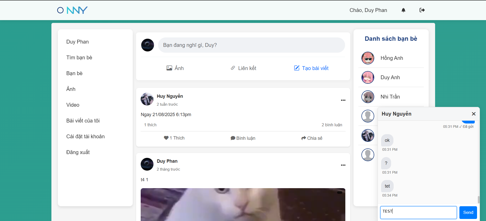
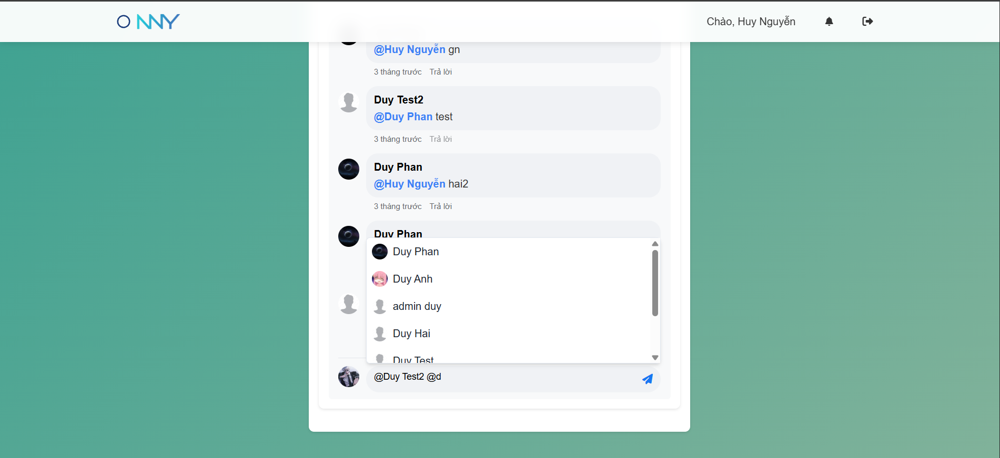
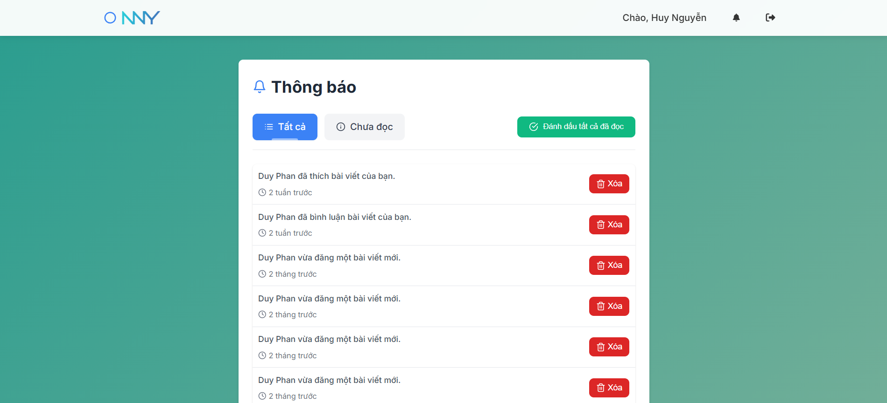
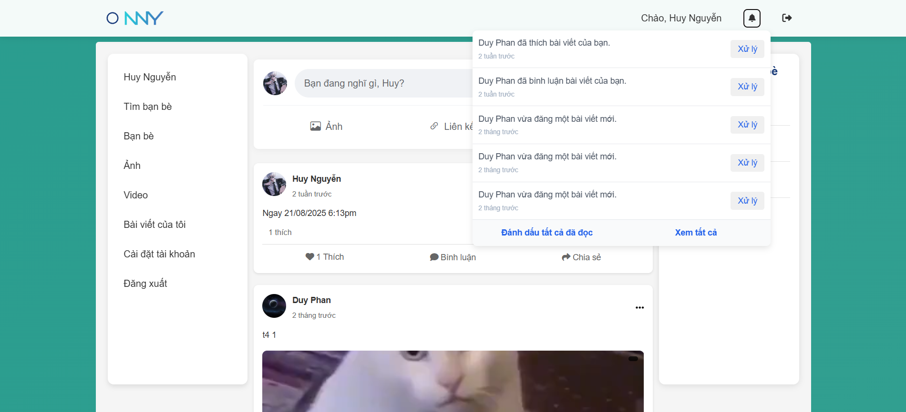

# NNY Social

**NNY Social** is a full-stack social networking platform focused on image/video sharing, real-time interactions, content and user management for both users and administrators.

---

## 🚀 Features

### 👤 User Management
- **Registration & Authentication:** Secure user sign up and login with Laravel Sanctum.
- **Profile Management:** Update avatar, cover photo, personal information, and social links.
- **Friend System:** Send, accept, cancel, search for friends.
- **Personal Messaging & Real-time Notifications.**

### 🖼️ Content Sharing
- **Create & Edit Posts:** Upload images/videos, share posts.
- **Media Upload:** Images are automatically converted to webp, videos are compressed, all media stored on Cloudinary CDN.
- **Smart Feed:** Prioritizes posts from friends, high engagement, and recency.

### 💬 Social Interaction
- **Like, Comment, Reply:** Engage with posts, reply/mention users in comments.
- **Real-time Notifications:** Receive instant updates for likes, comments, friend requests, and chat messages.

### 🛡️ Administration
- **Admin Dashboard:** Manage users, posts, and moderate content.
- **Analytics:** Track new users, posts, interactions, top users, banned accounts.
- **Content Moderation:** Ban/unban users, manage reported posts.

---

## 🖼️ Screenshots

### Homepage Feed


### User Profile


### Create/Edit Post


### Real-time Chat Popup


### Mention/Comment


### Notification/Notification Dropdown



### Admin Dashboard


---

## ⚙️ Tech Stack

| Category        | Technology                  |
|-----------------|----------------------------|
| **Backend**     | PHP 8.1+, Laravel 10       |
| **Frontend**    | Vite, TailwindCSS, JS, Alpine.js |
| **Database**    | MySQL 8.0+                 |
| **Media**       | Cloudinary (CDN)           |
| **Realtime**    | Laravel Websockets, Echo   |
| **Authentication** | Laravel Sanctum         |

---

## ⬇️ Getting Started

### 1. Clone & Install
```bash
git clone https://github.com/duyphan1410/NNY-social.git
cd NNY-social
composer install
npm install
```

### 2. Setup Environment
```bash
cp .env.example .env
php artisan key:generate
```
Configure these `.env` variables:  
- `APP_URL`, `DB_DATABASE`, `DB_USERNAME`, `DB_PASSWORD`  
- `CLOUDINARY_*`, `PUSHER_*`, `MAIL_*`

### 3. Migrate Database & Seed Data
```bash
php artisan migrate --seed
```

### 4. Run Servers
```bash
npm run dev          # Frontend Vite
php artisan serve    # Backend API
php artisan websockets:serve  # Websockets server
```
Visit the app at `http://127.0.0.1:8000`

---

## 🛡️ Security & Performance

- CSRF protection for all AJAX requests.
- Middleware guards for all critical routes: `auth`, `admin`.
- Websockets for scalable real-time features.
- Media optimized and delivered via CDN.
- Feed and heavy queries are cached for speed.
- Anti-spam, XSS protection, rate limiting for sensitive APIs.

---

## 📝 License
MIT License. See [LICENSE](LICENSE.md).

---

## 🙋‍♂️ Author
**Duy Phan**  
GitHub: [@duyphan1410](https://github.com/duyphan1410)

---

## 📢 Acknowledgments
- [Laravel](https://laravel.com/)
- [Cloudinary](https://cloudinary.com/)
- [TailwindCSS](https://tailwindcss.com/)
- [Pusher](https://pusher.com/) / [Laravel Websockets](https://beyondco.de/docs/laravel-websockets)
