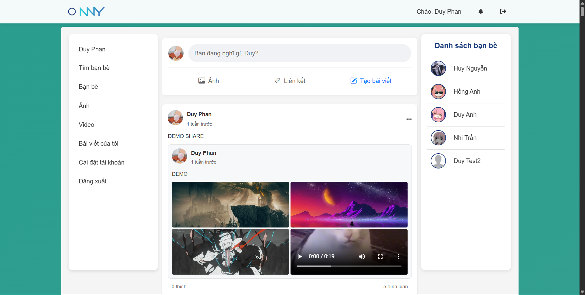
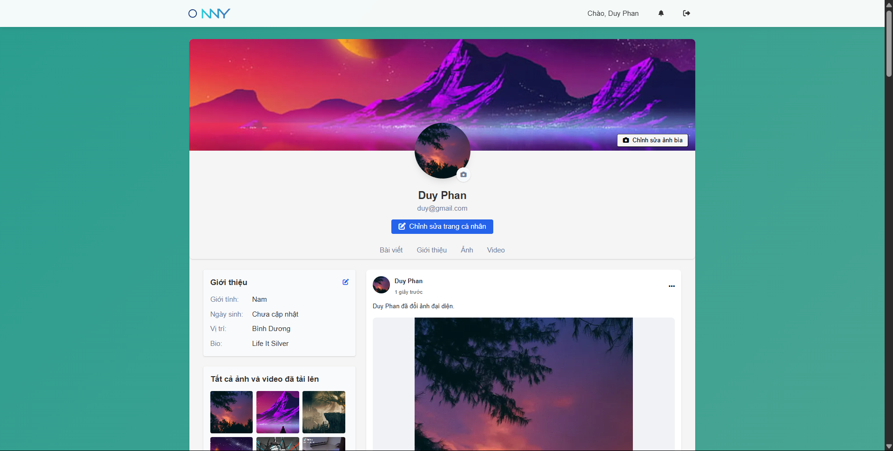
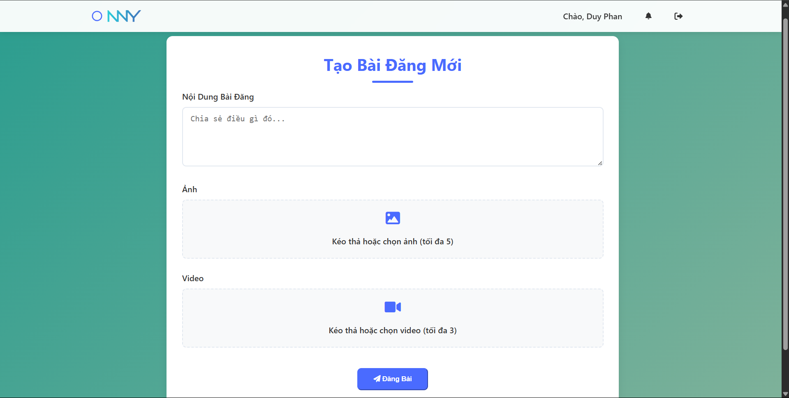
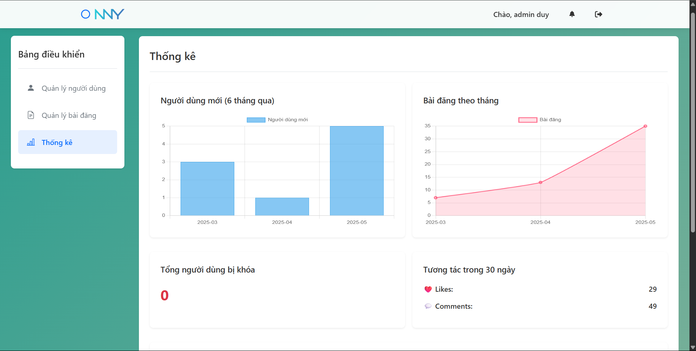

# 📱 NNY Social Network

A modern image-sharing social network built with **Laravel 10**, **Vite**, and **MySQL**. Users can register, post content (images/videos), like, comment, and manage profiles. The system also includes an admin dashboard for moderation and analytics.


## 📸 Screenshots

### Homepage


### User Profile


### Create Post


### Admin Dashboard


## 🚀 Features

### 👥 User Management
- **Registration & Authentication** - Secure user signup/login
- **Profile Management** - Customizable user profiles
- **Follow System** - Connect with other users

### 📱 Content Sharing  
- **Media Upload** - Share images and videos via Cloudinary
- **Auto Optimization** - Images converted to .webp, videos compressed
- **CDN Delivery** - Fast media loading worldwide

### 💬 Social Interaction
- **Like System** - Express appreciation for posts
- **Comments** - Engage in conversations
- **Real-time Notifications** - Instant updates via Pusher

### 🛡️ Administration
- **Admin Dashboard** - Complete moderation tools
- **Analytics** - User engagement insights
- **Content Moderation** - Manage reported content

## 🛠️ Tech Stack

| Category | Technology |
|----------|------------|
| **Backend** | PHP 8.1+, Laravel 10 |
| **Frontend** | Vite, TailwindCSS, JavaScript |
| **Database** | MySQL 8.0+ |
| **Media Storage** | Cloudinary |
| **Real-time** | Pusher |
| **Authentication** | Laravel Sanctum |
| **Email** | Laravel Mail |

## 📋 Prerequisites

Before installation, ensure you have:

- **PHP 8.1+** with extensions: BCMath, Ctype, Fileinfo, JSON, Mbstring, OpenSSL, PDO, Tokenizer, XML
- **Composer** (latest version)
- **Node.js 18+** and npm
- **MySQL 8.0+**
- **Git**

## ☁️ Cloudinary Integration

This project uses [Cloudinary](https://cloudinary.com/) for secure and optimized media storage.

- Images are uploaded and converted to `.webp` for performance.
- Videos are automatically compressed and resized if needed.
- Media links are stored and delivered via Cloudinary CDN.

You must configure the following environment variables in `.env`:

```env
CLOUDINARY_CLOUD_NAME=your_cloud_name
CLOUDINARY_API_KEY=your_api_key
CLOUDINARY_API_SECRET=your_api_secret
```
---

## 🚀 Getting Started

### 1. Clone the project

```bash
git clone https://github.com/duyphan1410/NNY-social.git
cd NNY-social
````

### 2. Install dependencies

```bash
composer install
npm install
```

### 3. Setup environment file

```bash
cp .env.example .env
php artisan key:generate
```

Then configure the `.env` file with your own:

* `APP_URL`
* `DB_DATABASE`, `DB_USERNAME`, `DB_PASSWORD`
* `CLOUDINARY_*`
* `MAIL_*`
* `PUSHER_*`

### 4. Setup database

```bash
php artisan migrate --seed
```

### 5. Compile frontend assets

```bash
npm run build
```

### 6. Serve the application

```bash
php artisan serve
```

Visit the app at `http://127.0.0.1:8000`.

---

## 🧪 Sample Accounts

Seeder will create sample users automatically. If not, you can register manually.

---

## 📁 Project Structure

```
NNY-social/
├── app/
│   ├── Http/Controllers/    # Application controllers
│   ├── Models/             # Eloquent models
│   ├── Middleware/         # Custom middleware
│   └── Services/           # Business logic services
├── config/
│   ├── database.php        # Database configuration
│   └── cloudinary.php      # Cloudinary settings
├── database/
│   ├── migrations/         # Database migrations
│   └── seeders/            # Sample data seeders
├── public/                 # Web server document root
├── resources/
│   ├── views/              # Blade templates
│   ├── js/                 # JavaScript files
│   └── css/                # Stylesheets
├── routes/
│   ├── web.php             # Web routes
│   └── api.php             # API routes
├── storage/                # File storage
├── .env.example            # Environment template
├── composer.json           # PHP dependencies
├── package.json            # Node.js dependencies
├── vite.config.js          # Vite configuration
└── README.md               # This file
```

---

## 📄 License

This project is licensed under the MIT License. See the [LICENSE](LICENSE.md) file for details.

---

## 👨‍💻 Author

**Duy Phan**
- GitHub: [@duyphan1410](https://github.com/duyphan1410)

## 🙏 Acknowledgments

- [Laravel](https://laravel.com/) - The web framework
- [Cloudinary](https://cloudinary.com/) - Media management
- [TailwindCSS](https://tailwindcss.com/) - Utility-first CSS
- [Pusher](https://pusher.com/) - Real-time features

## 📊 Project Status

- ✅ Core functionality completed
- ✅ User authentication & profiles
- ✅ Media upload & optimization
- ✅ Social interactions (like, comment)
- ✅ Admin dashboard

---

⭐ **If you find this project helpful, please give it a star!** ⭐


